# HoloFoodR

## A statistical programming framework for holo-omics data integration workflow

<br>

##### Tuomas Borman, Artur Sannikov, Robert D Finn, Morten Tønsberg Limborg, Alexander B Rogers, Varsha Kale, Kati Hanhineva, Leo Lahti

###### EuroBioC2026
###### 2026-06-04
######

---

# Agenda

- What is HoloFood?
- What is HoloFoodR?
- Results and the case study
- Discussion and conclusions


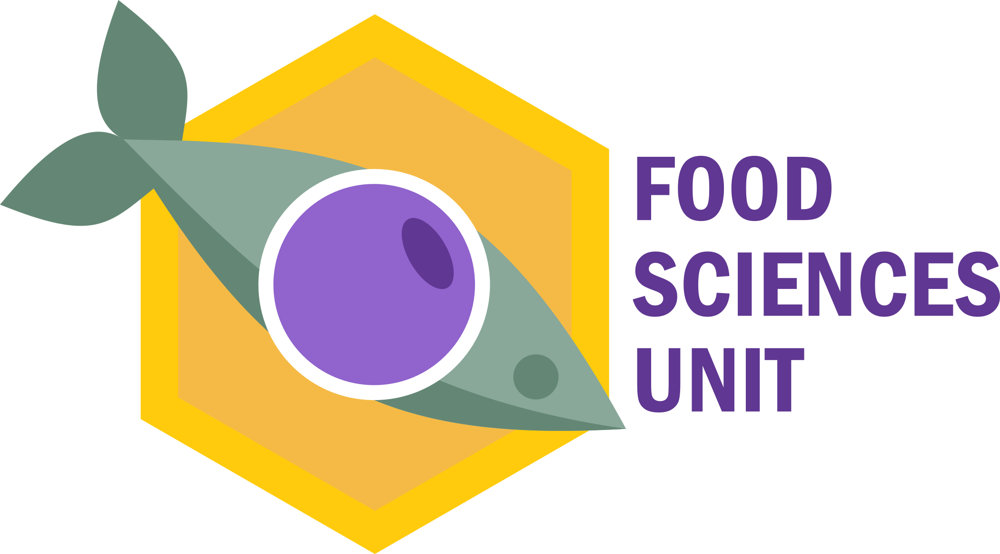

---

# What is HoloFood?

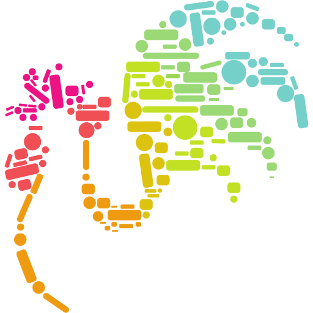

<v-clicks every="2">

- Horizon 2020 funded project
- Aimed to study the modulation of animal gut microbiota via food additives
- Two animals were studied: salmon (_Salmo salar_) and chickens
  (_Gallus gallus_)
- More than 2000 individual specimen
- Biomolecular and physiological measurements are also available
- Hologenome: a set of genomes of the host and microbiota
- HoloFood encompassed more than genomes: metabolomics, transcriptomics, etc.
- Read more about [HoloFood](https://www.holofood.eu/)

</v-clicks>


---
layout: two-cols
---

# HoloFood Data Portal

<v-clicks>
<ul>
  <li v-click="0">HoloFood Data Portal provides access to a lot of data</li>
  <li v-click="2">You can <mark class="bg-lightblue">download</mark> a lot of JSON data with Python...</li>
  <li v-click="2">...which you'll need to <mark class="bg-lightblue">transform</mark> into tables...</li>
  <li v-click="3">There should be an easier way to <mark class="bg-rose">download</mark> such valuable data...</li>
  <li v-click="3">There should be an easier way to <mark class="bg-rose">download</mark> such valuable data...</li>
</ul>
</v-clicks>

<!-- - HoloFood Data Portal provides access to a lot of data -->
<!-- - You can <mark class="bg-lightblue">download</mark> a lot of JSON data with Python... -->
<!-- - ...which you'll need to <mark class="bg-lightblue">transform</mark> into tables... -->
<!-- - ...and <mark class="bg-lightblue">relate</mark> those tables to each other -->
<!-- - There should be an easier way to <mark class="bg-rose">download</mark> such valuable data... -->
<!-- - ...and <mark class="bg-rose">transform</mark> into common Bioconductor formats -->

::right::

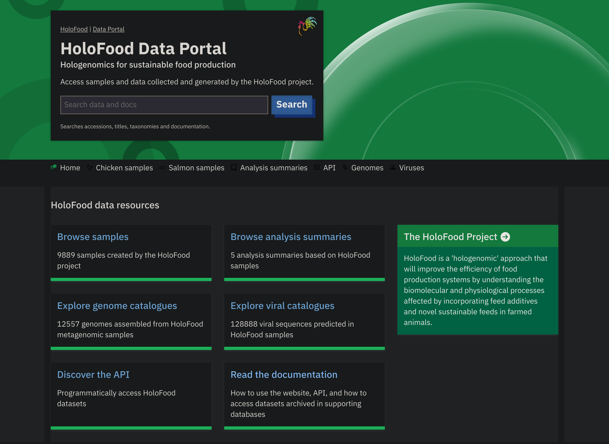

<br>
<div class="text-sm">
Rogers AB, Kale V, Baldi G, et al. HoloFood Data Portal: holo-omic datasets
for analysing host-microbiota interactions in animal production. Database
(Oxford). 2025;2025:baae112. doi:<a href="https://doi.org/10.1093/database/baae112">10.1093/database/baae112</a>
</div>


---

# HoloFoodR


## ...and <span v-mark.underline>transform</span> into common Bioconductor formats

<br>

<v-click>
These two formats are:

- TreeSummarizedExperiment
- MultiAssayExperiment

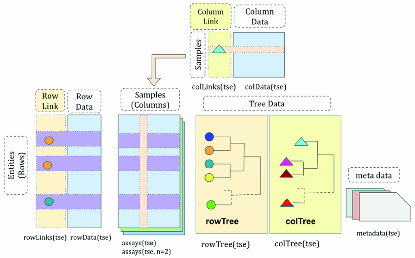

</v-click>

<!-- <arrow v-click="3" x1="300" y1="215" x2="360" y2="342" color="#953" width="2" arrowSize="1" /> -->


---

# HoloFoodR workflow

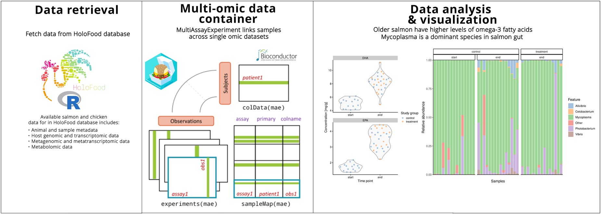


---

# Available functions

<div class="text-sm">

| Function              | Description                                                                                                            |
| --------------------- | ---------------------------------------------------------------------------------------------------------------------- |
| doQuery()             | Search HoloFood database.                                                                                              |
| getResult()           | Retrieve sample-level data (e.g. metadata and measurements) from the HoloFood database in MultiAssayExperiment format. |
| addMGnify()           | Integrate the results retrieved with getResult() with the metagenomic datasets                                         |
| getData()             | Similar to getResult(), more flexible, but returns unstructured data.                                                  |
| getMetaboLights()     | Retrieve processed metabolomic data from MetaboLights.                                                                 |
| getMetaboLightsFile() | Downloads raw metabolomic data files from MetaboLights.                                                                |

</div>


---

# Results

- Package released on [Bioconductor](https://bioconductor.org/packages/release//bioc/html/HoloFoodR.html)
- Case study with a formal analysis


---

# Case study

## Steps

<v-clicks>
<div v-click="0"> 1. <mark class="bg-red-500 text-white rounded">Fetch and integrate</mark> data from the HoloFood and MGnify databases.</div>
<div v-click="0"> 2. <mark class="bg-red-500 text-white rounded">Filter, clean, and transform</mark> data for analysis.</div>
<div v-click="2"> 3. <mark class="bg-red-500 text-white rounded">Explore and summarize</mark> the data.</div>
<div v-click="3"> 4. <mark class="bg-red-500 text-white rounded">Test associations</mark> between fatty acids, time, and treatment.</div>
<div v-click="3"> 5. <mark class="bg-red-500 text-white rounded">Test associations</mark> between microbiome composition, time, and treatment.</div>
<div v-click="4"> 6. <mark class="bg-red-500 text-white rounded">Characterize the joint variation</mark> between the parallel omics measurements.</div>
</v-clicks>


---

# About the data

<v-clicks>

- Study of a fermented seaweed additive in the salmon diet
- The seaweed contains plenty of bioactive components and a diverse microbiota
- More info on [HoloFood Salmon Experimental
  Design](https://www.holofooddata.org/analysis-summary/holofood-salmon-experimental-design)

</v-clicks>


---

# Fetch HoloFood data

- We fetched salmon samples

```r {1-9|11-13|14-16|17-22|all}
# Query the database
salmons <- HoloFoodR::doQuery("animals", system = "salmon", use.cache = TRUE)

# Get salmon data
salmon_data <- HoloFoodR::getData(
    accession.type = "animals",
    accession = salmons[["accession"]],
    use.cache = TRUE
)

# Get salmon samples
salmon_samples <- salmon_data[["samples"]]

# Get sample IDs
salmon_sample_ids <- unique(salmon_samples[["accession"]])

# Get salmon experiments as MAE object
mae <- HoloFoodR::getResult(
    salmon_sample_ids,
    use.cache = TRUE
)
```


---

# Fetch metagenomic data

```r {1-6|7-15|16-21|22|all}
library(MGnifyR)
# Create MGnify object
mg <- MgnifyClient(
    useCache = TRUE,
    cacheDir = ".MGnifyR_cache"
)
# Select only metagenomic_amplicon sample type
metagenomic_salmon_samples <- salmon_samples |>
    filter(sample_type == "metagenomic_amplicon")
# Search for sample IDs in MGnify database
salmon_analysis_ids <- searchAnalysis(
    mg,
    type = "samples",
    metagenomic_salmon_samples[["accession"]]
)
# Get metagenomic taxonomic data for salmon from MGnify
tse <- MGnifyR::getResult(
    mg,
    accession = salmon_analysis_ids,
    get.func = FALSE
)
mae <- addMGnify(tse, mae)
```


---

# Now to the actual results

- We did some pre-processing and transformation. You can read more about it in
  the [case study](https://ebi-metagenomics.github.io/HoloFoodR/articles/case_study.html)
- We did not find any effect of the treatment on the fatty acid concentrations
- But we did find time effect

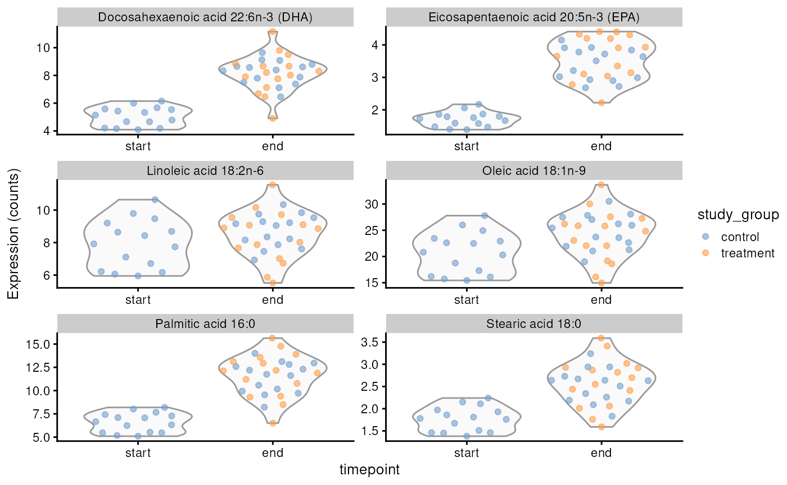


---

# Shannon alpha-diversity

- Alpha-diversity increased with time ($p < 0.01$)

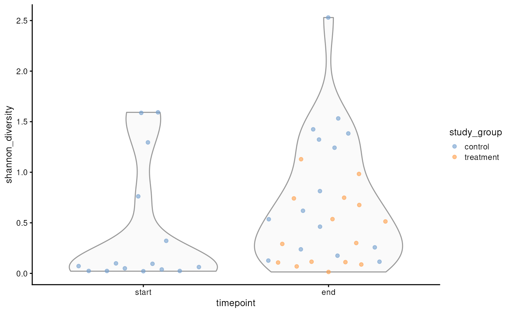


---

# Beta-diversity

- PCoA (Bray-Curtis) of microbial data
- Samples cluster by timepoint confirming the effect observed in
  alpha-diversity

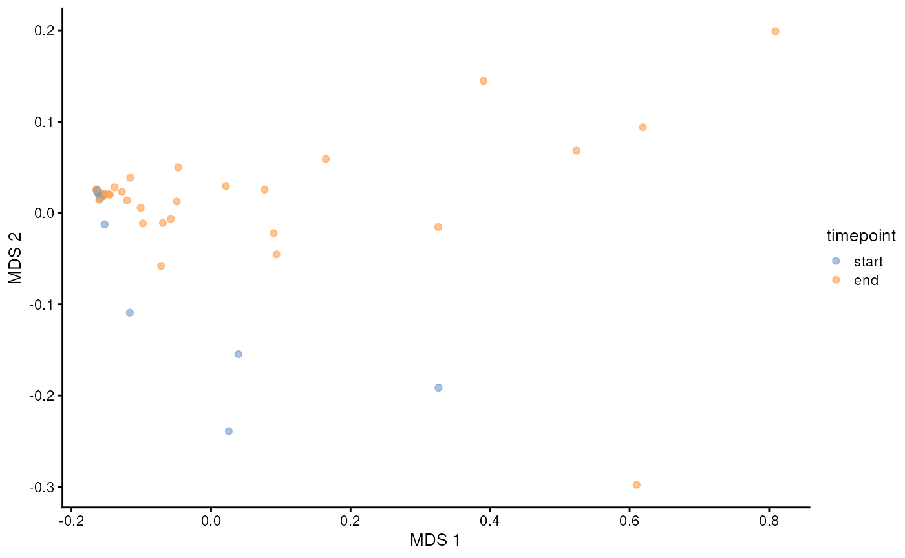


---

# Multi-omics integration

- Multi-omic factor analysis (MOFA)

<v-clicks>

- Discover latent factors that underlie the biological differences across
  multiple omic layers
- Is any fatty acid connected to any taxon?

<div class="flex items-center justify-between">
  <div class="text-left">
    Explained variance by factor
  </div>
  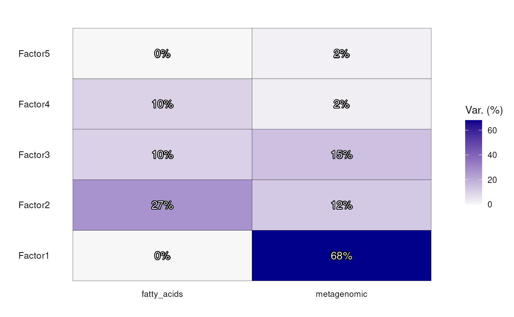
</div>

</v-clicks>


---

# Factor 1

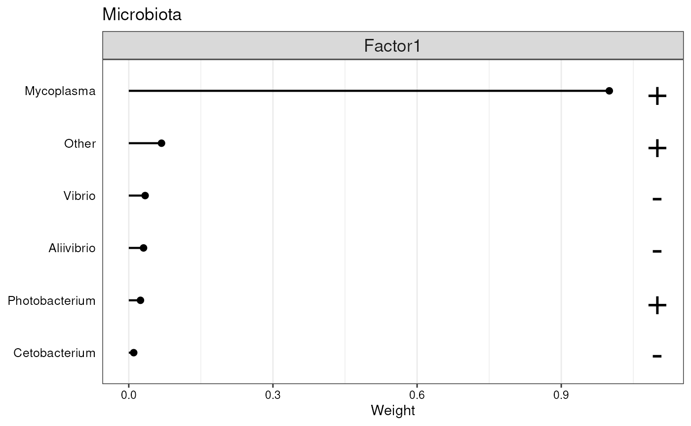

Mycoplasma is dominant in salmon gut but we did not find any covariation with
fatty acids.

<div class="text-sm">
K.Z. Zarkasi, G.C.J. Abell, R.S. Taylor, C. Neuman, E. Hatje, M.L. Tamplin, M.
Katouli, J.P. Bowman, Pyrosequencing‐based characterization of gastrointestinal
bacteria of Atlantic salmon (Salmo salar L.) within a commercial mariculture
system, Journal of Applied Microbiology, Volume 117, Issue 1, 1 July 2014,
Pages 18–27, <a href="https://doi.org/10.1111/jam.12514">10.1111/jam.12514</a>
</div>


---

# Factor 2

<div class="absolute bottom-79.3 left-16.5 w-30 h-0.3 bg-red-500"></div>
<div class="absolute bottom-68.5 left-34 w-13.1 h-0.3 bg-red-500"></div>
<div class="absolute bottom-51.5 left-16 w-31 h-0.3 bg-red-500"></div>

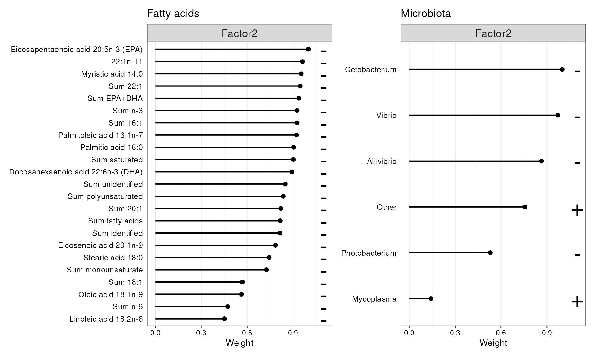

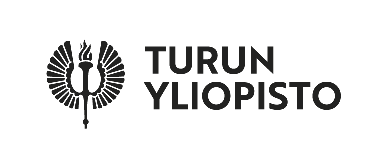
<!-- Cetobacterium, Vibrio, Aliivibrio are associated with EPA and DHA. -->
---


# Discussion and conclusions

- Holo-omic analysis relies on curated data
- We bridge the gap between data retrieval and downstream analysis by using
  standard data containers
- HoloFoodR can facilitate teaching &rarr; learn-by-doing for advanced learners
- Raw spectral metabolite data require external tools (e.g. notame)

<!-- We use two containers: MAE and TreeSE -->
<!-- We can use HoloFoodR to retrieve the data to teach advanced multi-omics -->


---
layout: default
---

# Authors

<div class="grid grid-cols-4 gap-3 mt-3">
  <div
    v-for="person in people"
    :key="person.name"
    class="flex flex-col items-center text-center"
  >
    
    <p class="mt-2 font-semibold text-sm">{{ person.name }}</p>
  </div>
</div>

<script setup>
  const base = import.meta.env.BASE_URL
  const people = [
    {
      name: "Tuomas Borman, UTU",
      photo: "/img/tuomas.jpg",
      position: "50% 40%",
    },
    { name: "Artur Sannikov, UTU", photo: "/img/artur.jpg" },
    { name: "Robert Finn, EMBL-EBI", photo: "/img/robert.jpg" },
    {
      name: "Morten Tønsberg Limborg, UCPH",
      photo: "/img/morten.png",
      position: "50% 20%",
    },
    { name: "Sandy Rogers, EMBL-EBI", photo: "/img/sandy.jpg" },
    { name: "Varsha Kale, EMBL-EBI, AAU", photo: "/img/varsha.jpg" },
    { name: "Kati Hanhineva, UTU", photo: "/img/kati.jpg", position: "50% 60%" },
    { name: "Leo Lahti, UTU", photo: "/img/leo.jpg" },
  ];
</script>

---

# Acknowledgements and funding

- HoloFood consortium for providing curated data and API
- This work was supported by the European Commission in the
  framework of the Horizon2020 Project FindingPheno [GA 952914]
  and HoloFood [GA 817729]. L.L. was supported by Research
  Council of Finland [grant number 330887]. A.S. and K.H. were
  supported by Jane and Aatos Erkko Foundation and the Research
  Council of Finland [grant numbers 321716, 334814]. M.T.L. was
  supported by the Danish National Research Foundation [grant
  DNRF143].


---


# Further references
- Tuomas Borman, Artur Sannikov, Robert D Finn, Morten Tønsberg Limborg,
  Alexander B Rogers, Varsha Kale, Kati Hanhineva, Leo Lahti, HoloFoodR: a
  statistical programming framework for holo-omics data integration workflows,
  Bioinformatics, Volume 41, Issue 11, November 2025, btaf605,
  https://doi.org/10.1093/bioinformatics/btaf605
- Borman T, Allen B, Lahti L (2025). MGnifyR: R interface to EBI MGnify
  metagenomics resource. R package version 1.5.1,
  https://github.com/EBI-Metagenomics/MGnifyR.
- [HoloFood data portal documentation](https://docs.holofooddata.org)
- Borman, Tuomas et al. (2025) Orchestrating Microbiome Analysis
  with Bioconductor. doi: [10.1101/2025.10.29.685036](https://doi.org/10.1101/2025.10.29.685036).
- [HoloFood consortium publications](https://docs.holofooddata.org/publications.html)


---
canvasWidth: 1920
canvasHeight: 1080
---

# Thank you and kiitos! Any questions?


<div class="flex h-full items-center justify-center">
  
</div>

